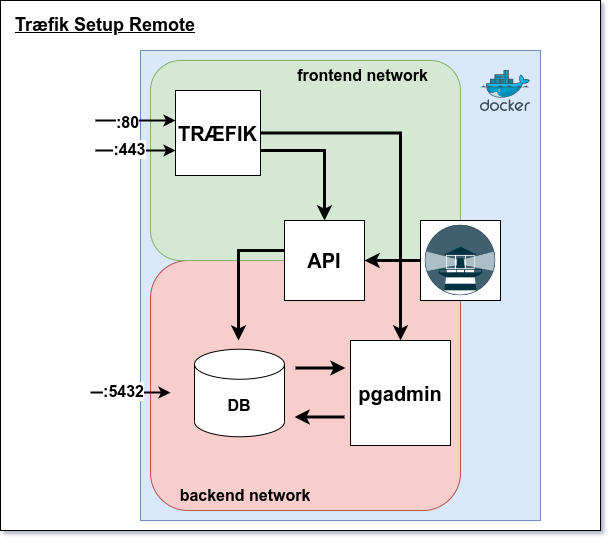

# Træfik Setup Remote

## Requirements

- [DigitalOcean](https://www.digitalocean.com/) account
- [Droplet with Docker preinstalled (Marketplace)](https://marketplace.digitalocean.com/apps/docker)
- [DockerHub](https://hub.docker.com/search?q=) DockerHub account
- [Domain](https://www.namecheap.com/) name (could be any provider)
- Your domain is pointing to DigitalOcean DNS servers
- Wildcard DNS record for your domain (*.your_domain.com)

## Features

- [Traefik](https://traefik.io/) as a reverse proxy
- [Let's Encrypt](https://letsencrypt.org/) for SSL certificates
- [Traefik Dashboard](https://docs.traefik.io/operations/dashboard/) for monitoring
- [PostgreSQL](https://www.postgresql.org/) for database
- [Docker](https://www.docker.com/) for containerization
- [Docker Compose](https://docs.docker.com/compose/) for container orchestration
- [DigitalOcean](https://www.digitalocean.com/) for cloud hosting

## Debugging

- Check if all containers are running with `docker ps -a`
- Check if all env variables are set in .env file and are correct
- Check if docker compose has read all environment variables with `docker-compose config`
- Check the logs of the individual container with `docker logs <container_name>` or `docker logs --follow <container_name>`
- Did you remember to add your domain to the DigitalOcean DNS servers?
- Did you remember to add a wildcard DNS record for your domain?
- Did you remember to create the acme.json file and set the correct permissions?
- Run your docker compose file with `docker-compose up` (without the -d flag) and check the output logs for errors

## Setup

### 1. Clone the repository to your server

```bash
  git clone https://github.com/tysker/3sem-traefik-setup-remote.git
```

### 2. Create a .env file and add your environment variables to it

```bash
# Lets-encrypt - Digital Ocean
PROVIDER=digitalocean
EMAIL=<your_email>
ACME_STORAGE=/etc/traefik/acme/acme.json
DO_AUTH_TOKEN=<your_digital_ocean_token> (see below step 3)

# Traefik
TRAFIK_DOMAIN=traefik.<your_domain>
DASHBOARD_AUTH=<your_traefik_dashboard_login> (see below step 4 and 5)

# API
API_DOMAIN=restapi.joergoertel.dk

# Postgres
POSTGRES_USER=<your_postgres_user>
POSTGRES_PASSWORD=<your_postgres_password>

# REST API SETUP
CONNECTION_STR=jdbc:postgresql://db:5432/
DB_USERNAME=<your_postgres_user>
DB_PASSWORD=ax2
DEPLOYED=TRUE
SECRET_KEY=super_secret_key (has to include at least 32 characters letters and numbers)
TOKEN_EXPIRE_TIME=1800000 (30 minutes)
ISSUER=<your_domain>

```
### 3. Generate digital ocean token

- To generate a digital ocean token, go to [DigitalOcean](https://cloud.digitalocean.com/account/api/tokens) and create a new token.


### 4. Install apache2-utils on your droplet terminal

```bash
  sudo apt-get install apache2-utils
``` 

### 5. Generate a traefik hashed dashboard login (droplet linux terminal )

```bash
  echo $(htpasswd -nb <your_username> <your_password>) | sed -e s/\\$/\\$\\$/g
```

### 6. Create an acme directory and an acme.json file

```bash
  mkdir ./acme
  touch ./acme/acme.json
```

```bash
  chmod 600 ./acme
  chmod 600 ./acme/acme.json
```

### 7. Run Docker

```bash
  docker-compose up -d
```

### 8. Stop Docker

```bash
  docker-compose down
```

### 9. Access Traefik Dashboard through browser

```bash
  traefik.<your_domain>
```

### 10. Access Your Rest Api

```bash
  <your_domain>/<your_api_path> (example: api.3sem.dk/api or restapi.3sem.dk/api)
```

***

### Reset DB data installation

(-v) // remove volumes
```bash
 docker-compose down -v 
```

```bash
 sudo  rm -rf ./data
```

### Connect you remote db to your local pgAdmin server

```bash
  <your_domain>:5432
```

***


