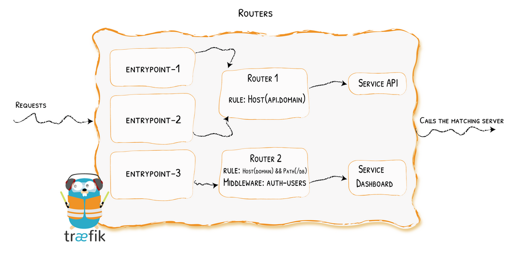
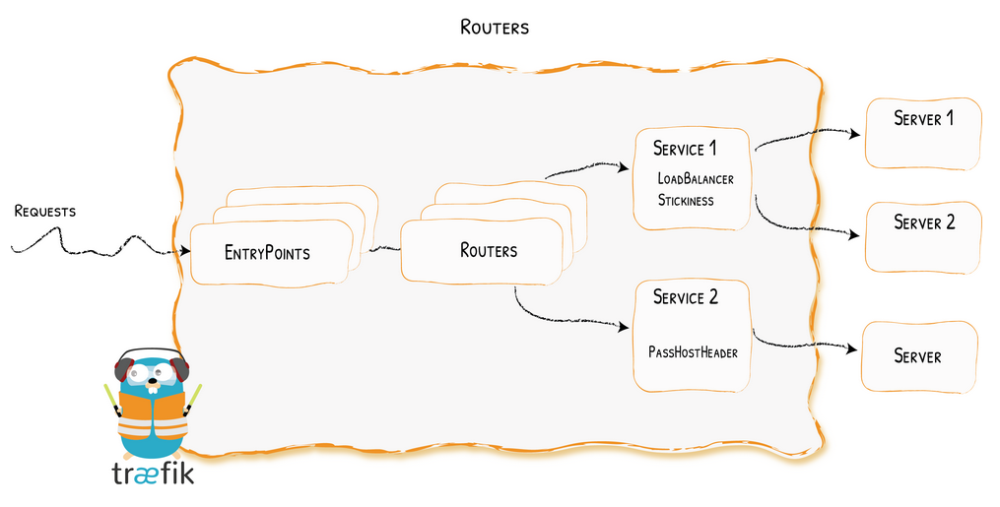

# Routers & Services

## Router

A router is in charge of connecting incoming requests to the services that can handle them. In the process, routers may 
use pieces of middleware to update the request, or act before forwarding the request to the service.

[Routers](https://doc.traefik.io/traefik/routing/routers/)

## Services

The Services are responsible for configuring how to reach the actual services that will eventually handle the 
incoming requests.

[Services](https://doc.traefik.io/traefik/routing/services/)

- Traefik creates, for each container, a corresponding service and router.
- The service is the container itself.
- The router is the entrypoint to the container.
- The service automatically gets a server per instance of the container, 
and the router automatically gets a rule defined by defaultRule (if no rule for it was defined in labels).
- 