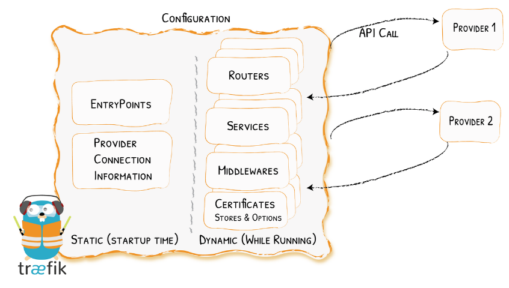

# Traefik Configuration

## Static vs Dynamic Configuration

Træfik supports two types of configuration: static and dynamic. The static configuration is the base configuration for Træfik. The dynamic configuration is used to configure the services that Træfik routes traffic to.
The static configuration is loaded first, and then the dynamic configuration is loaded. This means that the dynamic configuration can override the static configuration.
For example, if you define a service in the static configuration, and then define the same service in the dynamic configuration, the dynamic configuration will take precedence.

[Static&&Dynamic](https://doc.traefik.io/traefik/getting-started/configuration-overview/#static-vs-dynamic-configuration)

## How to configure Træfik

Træfik can be configured using a configuration file, command line arguments, and environment variables.

**Configuration File**

The configuration file is a YAML or a TOML file. It can be used to configure the entrypoints, providers, loggers, and other options. It is the most common way to configure Træfik.
https://doc.traefik.io/traefik/getting-started/configuration-overview/#configuration-file

Advantages:

- Easy to understand and read, especially for complex configurations.
- Can be version controlled (with Git, for example), allowing you to track changes over time.
- Allows for complex configurations that may not be possible or practical with other methods.

Disadvantages:

- Can be more difficult to manage in dynamic environments, as changes require modifying the file and reloading or restarting Traefik.
- Not as secure for sensitive data unless combined with other tools like Docker secrets or Kubernetes secrets.

Common Use Case: More static or complex environments where the benefits of version control and readability outweigh the need for dynamic changes

**Command Line Arguments**

Træfik can be configured using command line arguments. This is useful for quick testing or simple configurations.
https://doc.traefik.io/traefik/getting-started/configuration-overview/#command-line-arguments

Advantages:

- Quick and easy for simple configurations or for testing.
- No need to create a separate configuration file.

Disadvantages:

- Not suitable for complex configurations due to readability and manageability issues.
- Sensitive data might be exposed in process lists or logs.

Common Use Case: Quick testing or very simple deployments.

**Environment Variables**

Træfik can be configured using environment variables. This is useful for dynamic environments like Docker or Kubernetes.
https://doc.traefik.io/traefik/reference/static-configuration/env/

Advantages:

- Great for dynamic environments like Docker or Kubernetes where environment variables can be set per container.
- Can be a more secure way to handle sensitive data.

Disadvantages:

- Can become unwieldy for complex configurations.
- Might require additional tooling or scripts to manage the environment variables.

Common Use Case: Containerized environments like Docker or Kubernetes, or when using orchestrators or CI/CD pipelines that can easily manage environment variables.